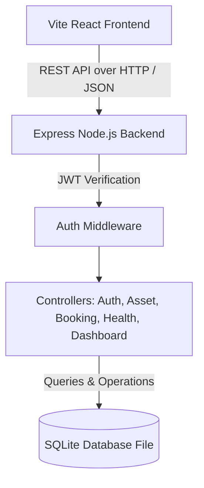

# Design Document: Smart Asset Management and Resource Allocation Platform

## 1. Problem Understanding
Organizations managing shared resources—such as the Cultural Council of IIT Roorkee—face logistical bottlenecks, scheduling conflicts, resource underutilization, and manual overhead. Shared assets (DSLR cameras, studio lights, audio equipment, props, costumes) are checked out by various sections and members, leading to scheduling disputes and high rates of equipment damage or lost items.

**CULT_OPEN** solves these operational challenges by offering:
- **Centralized Inventory Tracking**: Real-time status, condition, and availability pools of all shared assets.
- **Role-Based Workflows**: Tailored panels for resource consumers (students/council members) and administrators (section heads).
- **Automated Allocation Pipeline**: Clear booking requests, quantity checks, administrative review (approvals/rejections), and issue/return updates.
- **Audit Logs & Integrity Tracking**: System-wide logging of all transactional activities, logins, and asset status updates to maintain accountability.
- **Advanced Asset Health & QR Simulators**: Active malfunction logs, health resolution, and simulated QR-code tag scanning to model real-world logistics workflows.

---

## 2. System Architecture
The platform is designed as a modular, decoupled full-stack application following the Model-View-Controller (MVC) pattern on the backend and Component-driven architecture on the frontend.



### Key Components
- **Client (Frontend)**: React single-page application built on Vite. Styled entirely with customized Vanilla CSS, leveraging CSS custom properties, glassmorphism, responsive grid flex layouts, and keyframe animations. It is completely independent of external charting frameworks, rendering analytical visualizations using lightweight inline SVGs.
- **Server (Backend)**: Node.js Express API. Exposes JSON REST endpoints, manages JWT secure tokens, implements Role-Based Access Control (RBAC), and interacts with the database.
- **Database (Persistence)**: SQLite. Highly portable, self-contained, and file-based. Ensures zero configuration, zero service dependency, and 100% project reproducibility.

---

## 3. Database Schema
The relational SQLite database consists of six interconnected tables:

```mermaid
erDiagram
    USERS ||--o{ BOOKINGS : places
    USERS ||--o{ NOTIFICATIONS : receives
    USERS ||--o{ MAINTENANCE_LOGS : reports
    ASSETS ||--o{ BOOKINGS : has
    ASSETS ||--o{ MAINTENANCE_LOGS : undergoes

    USERS {
        INTEGER id PK
        TEXT name
        TEXT email UNIQUE
        TEXT password
        TEXT role
        DATETIME created_at
    }

    ASSETS {
        INTEGER id PK
        TEXT name
        TEXT category
        TEXT description
        INTEGER quantity_total
        INTEGER quantity_available
        TEXT status
        TEXT condition
        TEXT qr_code_data
        DATETIME created_at
    }

    BOOKINGS {
        INTEGER id PK
        INTEGER user_id FK
        INTEGER asset_id FK
        INTEGER quantity
        TEXT start_date
        TEXT end_date
        TEXT status
        TEXT purpose
        TEXT issued_at
        TEXT returned_at
        DATETIME created_at
    }

    MAINTENANCE_LOGS {
        INTEGER id PK
        INTEGER asset_id FK
        INTEGER reported_by FK
        TEXT issue_description
        TEXT status
        DATETIME created_at
    }

    AUDIT_LOGS {
        INTEGER id PK
        INTEGER user_id
        TEXT action
        TEXT details
        DATETIME created_at
    }

    NOTIFICATIONS {
        INTEGER id PK
        INTEGER user_id FK
        TEXT message
        INTEGER is_read
        DATETIME created_at
    }
```

### Table Definitions & Types
1. **users**: Stores identity credentials and system roles (`admin`, `consumer`).
2. **assets**: Tracks total physical inventory counts, remaining available items, categories, health condition, and unique QR identifier strings.
3. **bookings**: Represents borrowing requests, status workflows (`pending`, `approved`, `rejected`, `issued`, `returned`), usage durations, and issue/return timestamps.
4. **maintenance_logs**: Tracks broken assets, technical malfunction details, and repair/resolution tracking.
5. **audit_logs**: Chronicled system activities (operator, action type, text details) for accountability checks.
6. **notifications**: In-app push messages containing approval status changes or return deadlines.

---

## 4. API Overview
All API routes are prefixed with `/api` and require a valid Bearer JWT token in the `Authorization` header, except where noted.

| Category | Endpoint | Method | Role | Description |
| :--- | :--- | :--- | :--- | :--- |
| **Auth** | `/auth/register` | `POST` | Public | Registers a new user account |
| **Auth** | `/auth/login` | `POST` | Public | Authenticates credentials; returns token |
| **Auth** | `/auth/me` | `GET` | User | Decodes token and returns user profile |
| **Assets** | `/assets` | `GET` | User | Lists assets (supports search/filter) |
| **Assets** | `/assets/qr` | `GET` | User | Finds an asset by its scanned QR tag |
| **Assets** | `/assets/:id` | `GET` | User | Returns single asset + dynamic base64 QR |
| **Assets** | `/assets` | `POST` | Admin | Adds a new asset and generates QR code |
| **Assets** | `/assets/:id` | `PUT` | Admin | Updates asset details / total quantity |
| **Assets** | `/assets/:id` | `DELETE` | Admin | Deletes asset and cascades bookings |
| **Bookings**| `/bookings` | `GET` | User | Lists bookings (User gets own, Admin gets all) |
| **Bookings**| `/bookings` | `POST` | Consumer| Submits booking request (validates inventory) |
| **Bookings**| `/bookings/:id/status`| `PATCH`| Admin | Approves or rejects a pending request |
| **Bookings**| `/bookings/:id/issue` | `PATCH`| Admin | Issues asset (decrements available quantity) |
| **Bookings**| `/bookings/:id/return`| `PATCH`| Admin | Returns asset (increments available quantity) |
| **Health** | `/health` | `GET` | User | Returns health dashboard status and logs |
| **Health** | `/health/report` | `POST` | User | Reports damage; moves asset to maintenance |
| **Health** | `/health/resolve` | `POST` | Admin | Resolves issue; restores asset to active pool |
| **Audit** | `/audit/logs` | `GET` | Admin | Fetches global security audit logs |
| **Audit** | `/audit/notifications`| `GET` | User | Fetches user in-app notifications |
| **Audit** | `/audit/notifications/:id/read` | `PATCH` | User | Marks a specific notification as read |

---

## 5. Design Decisions
- **Vanilla CSS over Tailwind**: Decided to build the design system using pure CSS with modular class variables. This ensures maximum layout flexibility, clean and reliable dark theme styling (glassmorphism overlay effects), and isolates UI presentation from build-time compiler dependencies.
- **SQLite Database**: Chose SQLite for database integrity and zero setup overhead. The file-based system makes compiling and deploying immediately reproducible in local development, dev machines, and containerized Docker layers.
- **Embedded SVG Visualizations**: Avoided heavy, external chart packages (like Chart.js or Recharts) that often cause version conflicts in modern React ecosystems. Built interactive charts using React-driven custom inline SVG drawings.
- **QR Code Simulation Panel**: Solved the challenge of testing QR codes in sandbox terminals. By building an embedded scan-simulator console directly inside the admin console, developers and evaluators can mock scan operations cleanly.
